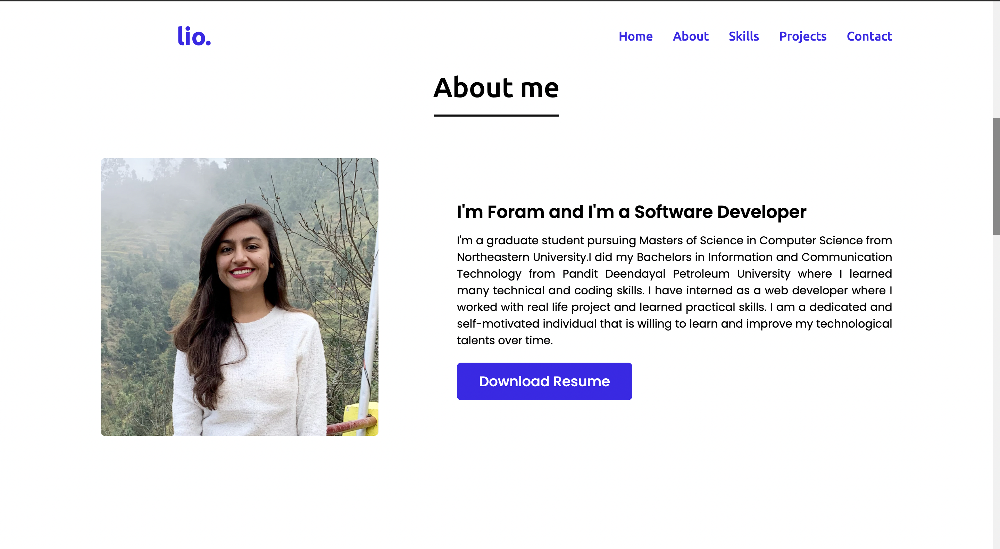
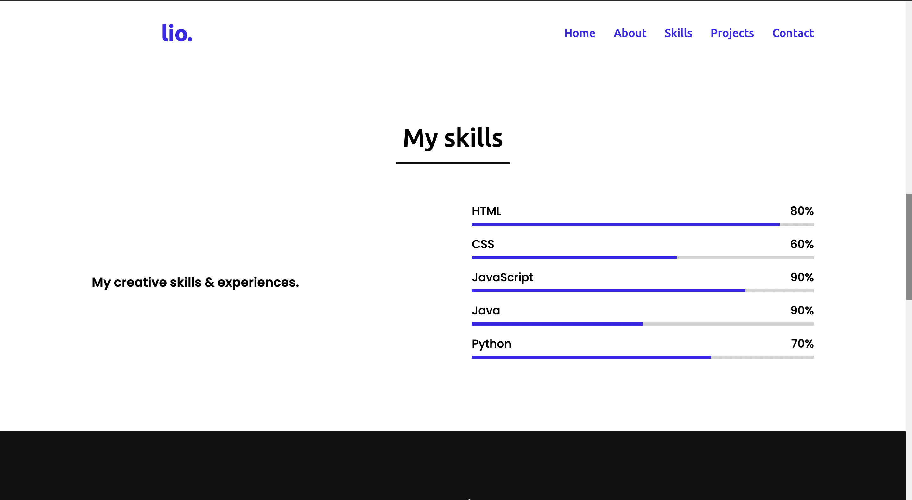
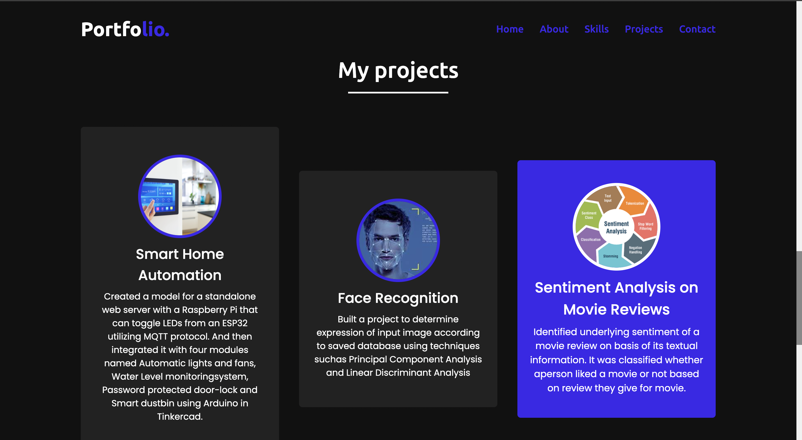
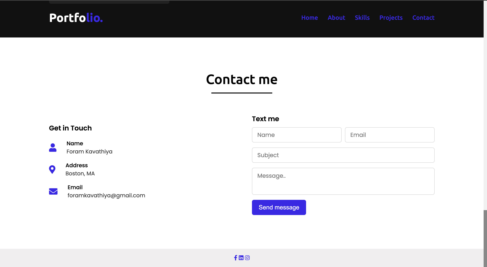

#  My Portfolio

#### Heroku link - 

##### - I have created a personal portfolio website using HTML, CSS and Javascript. There are five sections which are Home, About, Skills, Projects and Contact which are visible on the sidebar and I have deployed my website on heroku

##### - In Home section, my name is displayed with my designation.
##### - In About sextion, I have written about myself and my qualifications.
##### - In the skills sections, I have displayed about how much I am familiar with programming languages.
##### - In the project section, I have diplayed few of my projects that I've worked on.
##### - In the contact section, I have created a form for people to send me a message and reach out to me, also I have used font awesome icons to display my social profile (for eg linkedn) so that people can reach out to me there as well
##### Below you can find screen shot my home page, about page,skills page, project page and contact page

#### I have addressed the following components:
##### 1) I have included a landing page named index.html and it let people know what the site is about and contains the necessary links and navigation for people to get around the site. Below you can find a screenshot
##### 2) I have included a menu bar on top of the page on my every html page so that it is easy to navigate and there are no dead ends and the user can use the home button which is named "Posrtfolio" to get back to home page from anywhere which makes sure the user doesnot have to use the browser navigational button. I also have taken care of if the website is viewed on a small screen then the menu bar is still usable.
##### 3) I have implemented two or more internal links which links to my other pages i.e.  About, Skills, Porjects, Contact sections page which can be navigated through the menu bar

##### 4) I have also included more than one external link which opens in a new browser tab. This links are implemented in my contact section on the icons. There are icons of linkedn, facebook, instagram, clicking on it will open the respective page in a new tab. Screen shot of the same can be found below for reference purposes

##### 5) I have used a html table with CSS styling in the contact page. Basically i have created a form using a table, using that people can reach out to me. Each table defination has a input for the user to enter and submit Screen shot of the same can be found below for reference purposes

